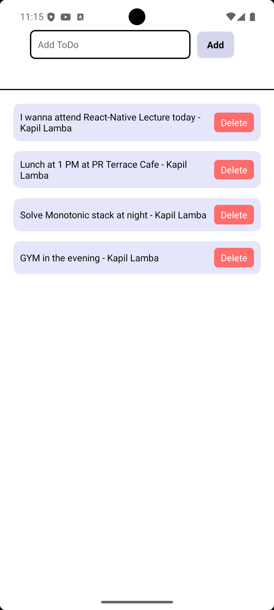

# React Native To-Do App

This is a simple React Native To-Do application that allows users to:

- **Schedule new tasks:** Add new to-do items using the input field and 'Add' button.
- **Delete existing tasks:** Remove tasks from the list by pressing the 'Delete' button next to each task.
- **Author name:** Each task displays the author's name (e.g., 'Kapil Lamba').

## Screenshot

---

## How to Run

1. Clone the repository.
2. Run `npm install` to install dependencies.
3. Start the app with `npm start` or `expo start`.

---

Feel free to contribute or suggest improvements!
